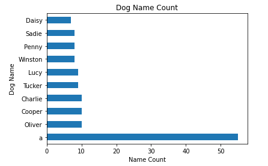
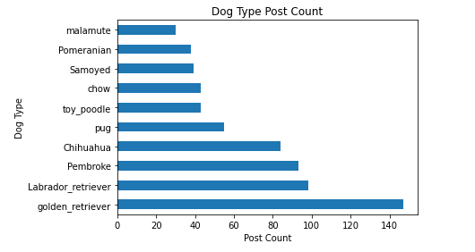
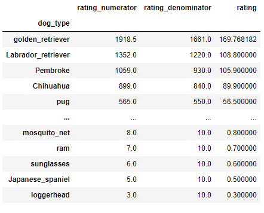
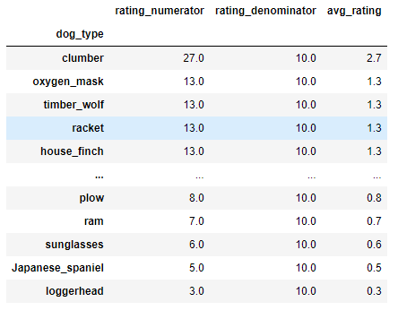
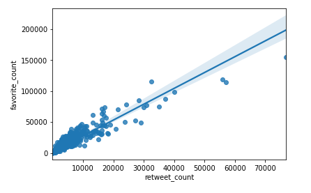

# They're Good Dogs Brent

For some people, who certainly love dogs will love to share what their dogs do. Like the majority of posts on [@dog_rates](https://twitter.com/dog_rates) or better known as [WeRateDogs](https://en.wikipedia.org/wiki/WeRateDogs), dog lovers love to share photos of their dogs. Surely this is a happiness that should be shared among the dog lovers.

Have you ever heard the quote in the title,"They are Good Dogs of Brent"?, which are widely used in memes to cover people who take issue about the WeDogRate ranking system. What happened in their system is, numerator is far far bigger than the denominator. Yes, you're not heard it wrong, that was their rating system. Even the ratings reach unreasonable numbers. However, this has become a habitual utilization for @dog_rates when determining the rating of their dogs. Interesting right?

>WeRateDogs is a Twitter account that rates people's dogs with a humorous comment about the dog. These ratings almost always have a denominator of 10. The numerators, though? Almost always greater than 10. 11/10, 12/10, 13/10, etc. Why? Because "they're good dogs Brent." WeRateDogs has over 4 million followers and has received international media coverage.

 

<i><b>WeRateDogs intended to humorously review pictures of dogs doing adorable poses. So, take it easy Brent</b></i>

There are many interesting insights from their twitter post. In this article, we want to show you what we find after wrangling some data from it.

 
 

### Most common name for dog

With the count more than 900 names, dog sure has varies name. This is kind of interesting, from the detection algorithm, people tends not to share their dog name to the WeRateDogs users. Usually people only share only it's stage or type in the Twitter.  
For the most common name for dog posted is Oliver, Cooper, and Charlie, each with count 10.

### Golden Retriever is the most popular dog type.

<i>Golden is always golden after all</i>

The dog which is has ranks 3 of 196 in [AKC Breed Popularity](https://www.akc.org/dog-breeds/golden-retriever/) is the most popular among WeRateDog posts. Has total retweet of 483833 and favorite of 1681869 outperforming other dogs breed.  

<i>Stuart, one of golden retriever.</i>

### Dog Rating

#### Most and lowest rating among all
If we sum all the y the WeRateDog post, we can get dog type total rating. As we can guess, more retweet is more rating that it get. And still, the number one is our beloved golden retriever. The most rated dog is golden_retriever with rate 169.76818181818166 and the lowest rated dog is loggerhead with rate 0.3.

 

<i>Loggerhead with no name.</i>

#### Most and lowest average rating among all
Then if we average the rating, we get the clumber is the highest among all. Our lovely golden isn't even in the top five. The most average rated dog is clumber with average rate 2.7, and he lowest average rated dog is loggerhead with average rate 0.3.

 

<i>Sophie the cute one.</i>

### Correlation
If we examine the correlation by using `.corr()` method on our final dataframe, the one whose have strong correlation is retweet_count and favorite_count, the score is 0.925.

